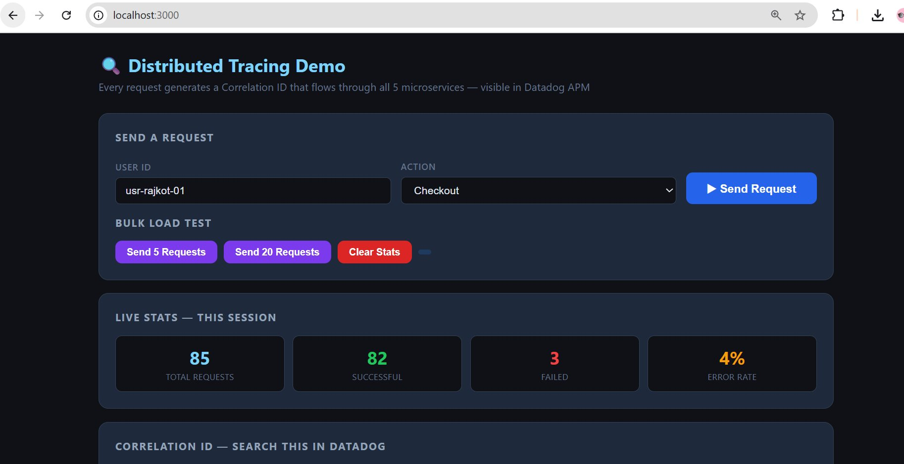
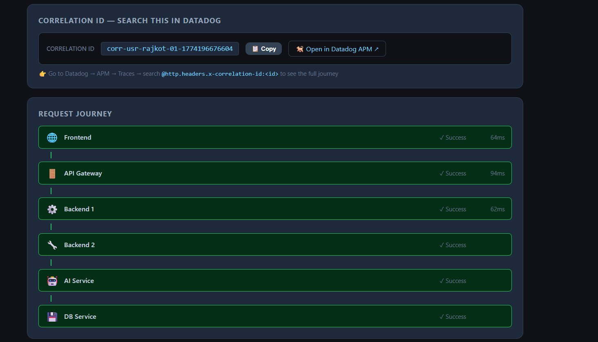
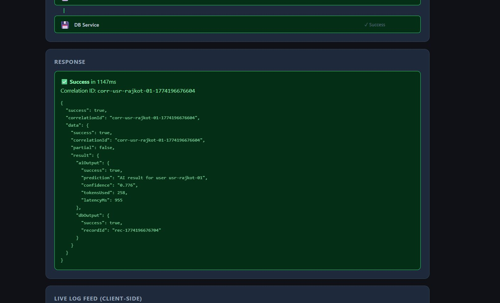
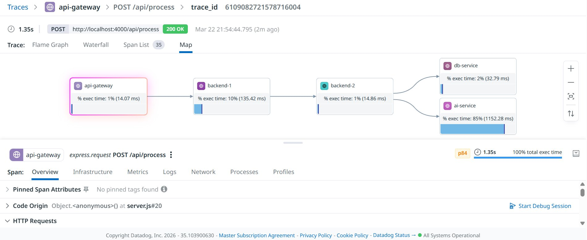

# 🔍 Distributed Tracing Demo — Centralized Logging with Datadog APM

> Track any user request across 5 microservices using a single Correlation ID — see the full journey, timing, and failures in one place.

Built as a hands-on answer to the Senior DevOps interview question:
> *"How do you implement centralized logging where you put one request ID and see the whole user journey across multiple microservices including AI services?"*

---

## 🎯 What This Solves

**The Problem with CloudWatch:**
Every service logs independently. To debug one request across 5 services you'd manually query 5 separate log groups and join them by timestamp — slow, painful, and impossible at scale. CloudWatch has no concept of a trace waterfall or span hierarchy.

**The Solution — Distributed Tracing:**
Generate one **Correlation ID** at entry. Inject it into every HTTP header. Include it in every log line. Search one ID → see the complete journey across all services instantly.

---

## 🛠 Alternative Observability Stacks

This demo uses **Datadog APM** (free via GitHub Student Developer Pack) but the same Correlation ID pattern works with any of these:

| Stack | Cost | Best For |
|-------|------|----------|
| **Grafana + Loki + Tempo** | Free OSS | Kubernetes, cost-conscious teams |
| **Jaeger + OpenTelemetry** | Free OSS | Vendor-neutral, used by Uber/Netflix |
| **ELK Stack** | Free self-hosted | Enterprise, powerful log search |
| **New Relic** | Free tier available | Startups, easy CloudWatch migration |
| **Datadog** | Paid (free student plan) | Best UX, plug-and-play, LLM observability |

> Switch backends without re-instrumenting by using [OpenTelemetry](https://opentelemetry.io/) — instrument once, export anywhere.

---

## 🏗 Architecture

```
Browser (localhost:3000)
    └── API Gateway (localhost:4000)      ← generates Correlation ID
         └── Backend-1 (:5001)            ← auth + payload enrichment
              └── Backend-2 (:5002)       ← fan-out to 2 services in parallel
                   ├── AI Service (:5003) ← LLM inference sim (20% error rate)
                   └── DB Service (:5004) ← DB write sim (10% error rate)

All 5 services → Datadog Agent (:8126) → Datadog Cloud APM
```

Every request gets a unique Correlation ID like `corr-usr-rajkot-01-1774196676604` that travels through all services via HTTP headers using the **W3C TraceContext standard**.

---

## ✅ Prerequisites

- [Docker Desktop](https://www.docker.com/products/docker-desktop/) installed and running
- Datadog account — free via [GitHub Student Developer Pack](https://education.github.com/pack) (2 years Pro access)
- Your Datadog API Key (the long 32-character string — NOT the Key ID)

---

## 🚀 Quick Start (5 minutes)

### Step 1 — Clone the repo

```bash
git clone https://github.com/YOUR_USERNAME/distributed-tracing-demo.git
cd distributed-tracing-demo
```

### Step 2 — Get your Datadog API Key

1. Log in to your Datadog account
2. Go to **Organization Settings → API Keys**
3. Click the 👁 eye icon to reveal the full key and copy it

> **Find your Datadog site from the browser URL:**
>
> | Browser URL | Use this DD_SITE |
> |-------------|-----------------|
> | `app.datadoghq.com` | `datadoghq.com` |
> | `app.us5.datadoghq.com` | `us5.datadoghq.com` |
> | `app.datadoghq.eu` | `datadoghq.eu` |
> | `app.us3.datadoghq.com` | `us3.datadoghq.com` |

### Step 3 — Configure environment

```bash
cp .env.example .env
```

Open `.env` and add your key:
```
DD_API_KEY=your_32_character_api_key_here
```

Open `docker-compose.yml` and update `DD_SITE` under `datadog-agent`:
```yaml
- DD_SITE=us5.datadoghq.com   # change to match your region
```

### Step 4 — Start all services

```bash
docker-compose up --build
```

Wait ~30 seconds until you see all services running:

```
ai-service   | AI Service running on :5003 — error rate: 20%
db-service   | DB Service running on :5004 — error rate: 10%
backend-1    | Backend-1 running on :5001
backend-2    | Backend-2 running on :5002
api-gateway  | API Gateway running on :4000
frontend     | Frontend running on :3000
```

### Step 5 — Open the demo

👉 **http://localhost:3000**

---

## 🎮 Using the Demo

### Send requests

1. Enter a **User ID** (e.g. `usr-rajkot-01`)
2. Select an **Action** (Checkout, AI Recommend, Search, Profile Update)
3. Click **▶ Send Request** — watch the journey animate in real time
4. Or click **Send 5 Requests** / **Send 20 Requests** to generate bulk traffic

> Send at least **20-50 requests** to get meaningful data in Datadog dashboards.

### Reading the journey

- 🟢 **Green** = service handled the request successfully
- 🔴 **Red** = service failed — shows exact error and latency
- ⏸ **Waiting** = service was never reached (blocked by upstream failure)

---

## 📸 Demo Screenshots

### 1 — Frontend: Live Stats Dashboard

After sending multiple requests you can see total requests, success count, failures and error rate in real time.



---

### 2 — Complete Successful User Journey

Every hop shows ✓ Success with timing. The **Correlation ID** (`corr-usr-rajkot-01-1774196676604`) is displayed and travels through all 6 services.



---

### 3 — Full Response with AI Output and DB Record

The response payload includes the `correlationId`, AI prediction with confidence score and token usage, and the DB record ID — all tied to one request.



---

### 4 — The Same Trace in Datadog APM (Map View)

Datadog auto-generates this service dependency map for every single trace:
- `api-gateway` → `backend-1` → `backend-2` → `db-service` + `ai-service` (parallel calls)
- Shows execution time per service — AI Service took **85% (1152ms)** of total request time
- Total trace duration: **1.35s**



This is the **centralized view the interview question was about** — one Trace ID, full picture across all services, no manual log joining.

---

## 🔍 Finding Your Traces in Datadog

### View all traces

1. Go to **APM → Traces → Explorer**
2. Search: `service:api-gateway env:demo`
3. Click any trace row → opens the full waterfall

### Search by Correlation ID

Copy the Correlation ID from the frontend UI, then in Datadog Traces Explorer:
```
@http.request_headers.x-correlation-id:corr-usr-rajkot-01-1774196676604
```

### Switch between views

In any trace detail page:
- **Flame Graph** — nested span view with timing
- **Waterfall** — sequential hop view
- **Map** — service dependency diagram (Screenshot 4 above)
- **Span List** — all 35 spans listed flat

### Correlate logs with a trace

1. Open any trace in Datadog
2. Click the **Logs** tab in the bottom panel
3. All logs from ALL services for that trace appear — automatically filtered by trace ID

### See error breakdown by service

**APM → Services → ai-service** → error rate over time, p99 latency, top error types

### Build an error rate dashboard

- **Dashboards → New Dashboard**
- Add widget: **Timeseries**
- Query: `sum:trace.express.request.errors{*} by {service}`
- Shows which service has the most errors over time

---

## 🎛 Adjusting Error Rates

Change in `docker-compose.yml` and restart:

```yaml
ai-service:
  environment:
    - ERROR_RATE=20   # 0-100, percentage of requests that fail

db-service:
  environment:
    - ERROR_RATE=10
```

Or without rebuilding:
```bash
# Increase AI service failures to 50%
docker-compose up -d --no-deps -e ERROR_RATE=50 ai-service
```

---

## 📁 Project Structure

```
distributed-tracing-demo/
├── docker-compose.yml
├── .env.example
├── screenshots/
│   ├── screenshot-1-frontend-stats.png
│   ├── screenshot-2-journey-success.png
│   ├── screenshot-3-response.png
│   └── screenshot-4-datadog-map.png
├── frontend/
│   ├── server.js
│   └── public/index.html
├── api-gateway/
│   ├── server.js        ← generates Correlation ID
│   ├── tracer.js        ← dd-trace init (must be first import)
│   └── logger.js        ← structured JSON logger
├── backend-1/           ← auth + enrichment
├── backend-2/           ← parallel fan-out to AI + DB
├── ai-service/          ← 20% intentional error rate
└── db-service/          ← 10% intentional error rate
```

---

## ⚙️ How Correlation ID Propagation Works

```javascript
// api-gateway — generates at entry point
const correlationId = `corr-${userId}-${Date.now()}`;

// Every downstream service forwards it
await axios.post(NEXT_SERVICE_URL, body, {
  headers: {
    'x-correlation-id': correlationId,
    'x-user-id': userId
  }
});
```

```javascript
// tracer.js — first line in EVERY service
const tracer = require('dd-trace').init({
  logInjection: true,  // auto-injects trace_id into every log line
});
// dd-trace also auto-propagates W3C traceparent header on every HTTP call
```

```javascript
// Every log line includes full trace context
logger.info('Processing request', { correlationId, userId });
// Output: {"dd":{"trace_id":"abc...","span_id":"def..."},"correlationId":"corr-..."}
```

---

## 🛑 Stop the Demo

```bash
docker-compose down
```

---

## 📚 References

- [W3C TraceContext Standard](https://www.w3.org/TR/trace-context/)
- [Datadog APM — Node.js docs](https://docs.datadoghq.com/tracing/trace_collection/dd_libraries/nodejs/)
- [OpenTelemetry SDK for Node.js](https://opentelemetry.io/docs/languages/js/)
- [Grafana Loki + Tempo — free alternative](https://grafana.com/oss/loki/)
- [Jaeger Distributed Tracing — CNCF](https://www.jaegertracing.io/)
- [GitHub Student Developer Pack — Datadog](https://education.github.com/pack)
